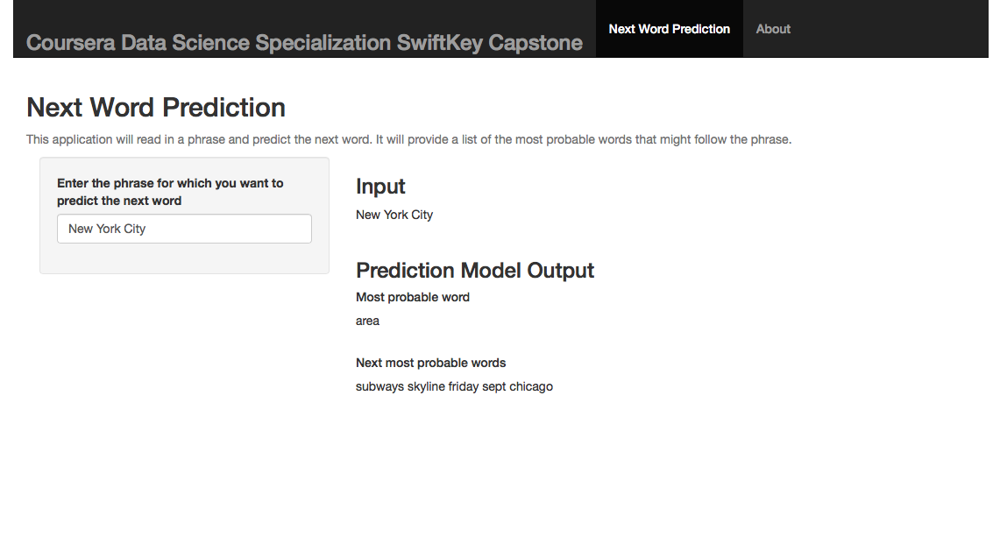

Coursera Data Science SwiftKey Capstone
FinalProjectReport
========================================================
author: Ellen Wang
date: Feb 19, 2019
autosize: true

RStudio Presentation: Next Word Prediction

Overview
========================================================

Smart word prediction is one improvement to mobile user experience, which makes it easier for people to type on their mobile devices.

In this project, the goal is to build predictive text models. We have performed analysis on a large collection of English documents from three different sources: blog articles, news, and Twitter. Then we built n-gram model (n = 2,3,4) using the texts in the collection.

Algorithm
========================================================
The prediction is performed by the following steps:

1. Remove profanities, stopwords, numbers, punctuations and non-ASCII symbols in the phrase.
2. Extract the last three words of the phrase.
3. Find a list of the most probable words from the frequency tables. The algorithm will search the 4-grams first before moving to 3- and 2-grams. The model will output the most common stopwords if no predicton can be made with n-grams.

Application
========================================================
The [Shiny app](https://wangchenxi.shinyapps.io/FinalProject/) is reactive; it takes as input a phrase in a text box input and outputs a prediction of the next word automatically.

Possible Improvements
========================================================
While it is able to predict quite accurately for specific phrases extracted from Twitter and news, it does not perform as well for new instances.

The algorithm can be improved by increasing the volume of training data.

Another improvement would be to consider long-distance dependencies. For example, in the sentence "The computer which I had just put into the machine room on the fifth floor crashed", the word "crashed" should follow from the word "computer".
